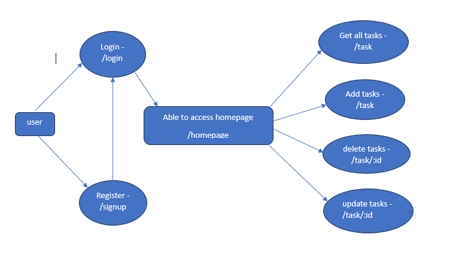

# Terra-Do-FrontEnd-Assessment

<!-- GUIDELINE TO RUN PROJECT CODEBASE -->

1. clone the repository

2. go inside client folder 
    2.1. run command - npm install - (to download all  dependencies)
    2.2. run command - npm start - to start application

3. go inside server folder 
    3.1. run command - npm install - (to download all dependencies)
    3.2. setup .env file ,create .env file and mention 
        3.2.1. PORT 
        3.2.2. MONGODB_URI - your mongo atlas uri/compas
        3.2.3. SECRET - any random string of characters
    3.3. run command - npm run dev - to start application

4. both server and cliend will start

<!-- ======================================================================== -->

<!-- THINGS HAVE INCLUDED , DONE -->

<!-- tech used : -->
MongoDB, Nodejs, ReactJS, Redux, bootstrap,tailwind css

<!-- Implemented :  -->
authentication
CRUD operation with task 

<!-- api's -->
/register - for registration ,
/login - for login ,
/task - get all tasks ,
/task - add tasks ,
/task/:id - update task ,
/task/:id - delete task ,

<!-- done all components : -->
Login ,
Register ,
Navbar ,
GetAllTasks , 
AddTasks ,
UpdateTasks ,

<!-- created two page to manage all components :  -->
landingpage ,
homepage

<!-- functionalities done :  -->
token verification ,
password hashing ,
pagination ,
searching ,
if user is not login then he/she can't able to access next route

<!-- FLOW of the code -->
